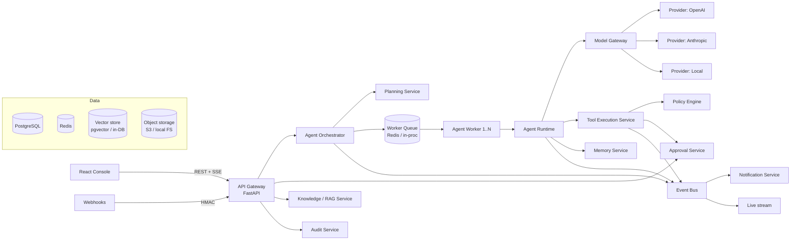
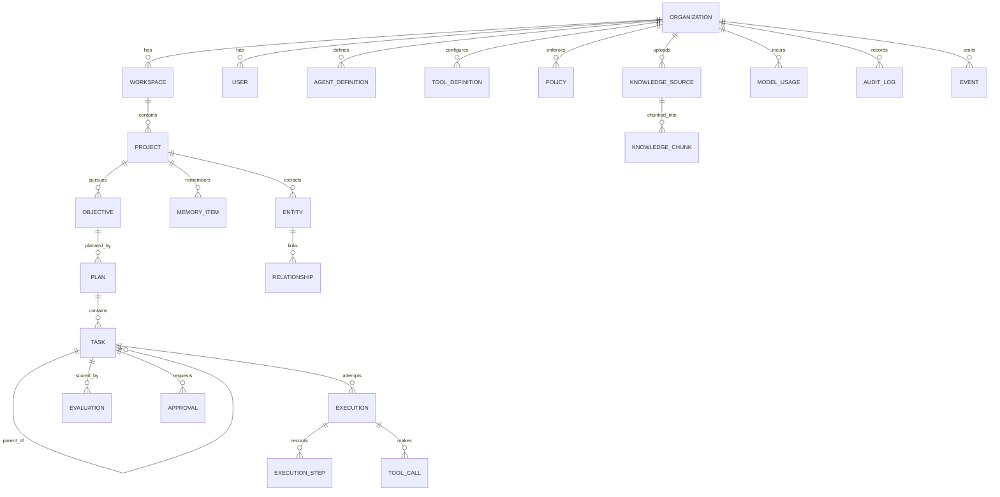
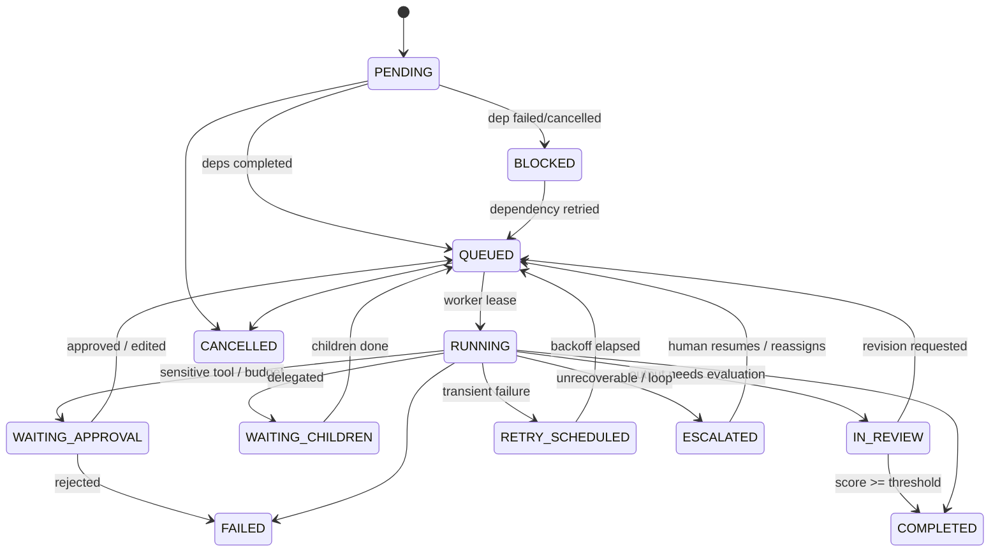

# AgentOS — System Design

This document is the design-phase deliverable that preceded implementation. The
dedicated documents in this folder (`ARCHITECTURE.md`, `AGENT_RUNTIME.md`, …)
expand each area and describe the code as built.

## 1. System architecture



Services are Python packages inside one deployable codebase with clear
interfaces. The same image runs as `api` or `worker`; each tier scales
independently.

## 2. Agent architecture

Agents are **data, not classes**. An `AgentDefinition` row holds role,
instructions, tool permissions, model policy, budgets, memory config and
escalation/approval rules. Behaviour comes from four collaborating components:

| Component | Responsibility |
|---|---|
| `AgentRuntime` | Runs the lifecycle loop for one task attempt |
| `ContextBuilder` | Assembles working memory, retrieved memory, dependency outputs, feedback; wraps untrusted data |
| `DecisionParser` | Validates/repairs model output into an `AgentDecision` |
| `ToolExecutor` | Permission + policy + approval + timeout + retry + logging |

Decision schema returned by the model each iteration:

```json
{"action": "tool_call|final|delegate|escalate",
 "reason_summary": "…", "confidence": 0.0-1.0,
 "tool": "…", "arguments": {…},
 "output": {…}, "subtasks": [{…}], "next_action": "…"}
```

## 3. Database schema (core)



Every tenant-owned table carries `org_id` (indexed) and every repository query
is scoped by it. Full column lists live in `backend/app/models/`.

## 4. Task & agent execution state machines



Agent lifecycle inside one attempt:
`THINK → PLAN → SELECT_TOOL → EXECUTE_TOOL → OBSERVE → EVALUATE → (CONTINUE | RETRY | ESCALATE | COMPLETE)`.
A checkpoint is persisted after every step so a restarted worker resumes rather
than restarts.

## 5. Tool system

`Tool` = implementation (Python class) + `ToolDefinition` (DB config: enabled,
permission level, timeout, retry policy, approval flag, org overrides).
Permission levels: `read`, `write`, `external`, `privileged`. Execution pipeline:

1. schema validation of arguments,
2. agent permission check (allowed/prohibited lists),
3. policy engine (deny / require approval / require QA),
4. taint check (privileged args sourced from untrusted content),
5. budget check,
6. execution with timeout and retry/backoff,
7. output schema validation + sanitisation,
8. `ToolCall` record, metrics, `TOOL_CALLED`/`TOOL_COMPLETED` events.

## 6. Memory architecture

| Layer | Storage | Scope | Trust |
|---|---|---|---|
| Working | task checkpoint | one task attempt | n/a |
| Session | `memory_items` (`layer=session`) | project | unverified → verified |
| Long-term | `memory_items` (`layer=long_term`) | organization | approved only |
| Semantic | embeddings on memory items + vector store | org/project | inherits |
| Structured | `entities` + `relationships` | org/project | per fact |

Provenance on every item: source type (agent/tool/document/human), source
reference, task, agent, timestamp, and trust level. Promotion requires QA or
human approval and is audit-logged.

## 7. Security architecture

- JWT auth, bcrypt passwords, RBAC (`owner`, `admin`, `operator`, `approver`, `viewer`).
- Tenant isolation: `org_id` scoping in a shared repository layer + tests.
- Secrets: Fernet (AES-128-CBC + HMAC) encryption at rest, key from env/KMS.
- Agents: least-privilege tool lists, policy engine, approvals.
- Prompt injection: untrusted-data envelopes with nonces, injection scanner,
  redaction/quarantine, taint tracking for privileged tool arguments, schema-validated outputs.
- Rate limiting (token bucket, Redis-backed in prod), input sanitisation,
  SSRF-safe HTTP tool, HMAC webhooks, hash-chained audit log.

## 8. Repository layout

```
backend/            FastAPI app, workers, migrations, tests, load tests
  app/api/          REST routes (gateway)
  app/core/         config, db, security, events, rate limiting, telemetry
  app/models/       SQLAlchemy models
  app/services/     orchestrator, planning, runtime, tools, memory, rag,
                    model_gateway, approvals, policy, evaluation, budget,
                    audit, notifications, queue, security
  app/seed/         default agents, tools, policies, demo datasets
  alembic/          migrations
  tests/            unit, integration, e2e
  loadtest/         load simulation
frontend/           React + TypeScript + Vite console
infra/              k8s manifests, Prometheus, Grafana, OTel collector
docs/               documentation
```

## 9. REST API (summary — see `API.md`)

`/api/v1/auth`, `/orgs`, `/users`, `/agents`, `/tools`, `/policies`,
`/knowledge`, `/projects`, `/projects/{id}/start|cancel|stream|graph|timeline`,
`/tasks/{id}/retry|cancel|reassign`, `/executions`, `/approvals/{id}/decision`,
`/memory`, `/entities`, `/costs`, `/audit`, `/settings`, `/webhooks/support/{org}`,
plus `/healthz`, `/readyz`, `/metrics`.

## 10. Implementation milestones

| Phase | Scope | Exit criteria |
|---|---|---|
| 0 | PRD + design | Docs reviewed |
| 1 | Core platform: config, DB models, migrations, auth/RBAC, tenancy, audit, events | Unit tests pass, API boots |
| 2 | Model gateway, tool framework, policy engine, budgets | Permission/fallback tests |
| 3 | Planning engine, orchestrator, runtime, delegation, queue/workers, recovery | Planner/delegation/retry tests |
| 4 | Memory + RAG | RAG/memory/injection tests |
| 5 | Approvals, evaluator/QA loop, flagship demos | E2E demo tests |
| 6 | Frontend console | UI builds, screenshots |
| 7 | Infra (Docker, Compose, K8s, CI, Prometheus, Grafana, OTel), load tests, docs | Load test report |

## 11. Testing strategy

Pyramid: fast unit tests on pure components (DAG validation, policy DSL, decision
parser, injection scanner, chunker, BM25, router, budget logic); integration
tests against a real database exercising API + services; end-to-end tests that
run full flagship projects with workers and approvals; fault-injection tests per
failure mode; tenant-isolation tests that attempt cross-org access on every
resource; load tests driven by the simulation harness.

## 12. Scaling strategy

- API is stateless → horizontal pods behind a load balancer.
- Workers pull from the queue; task ownership is a DB lease
  (`UPDATE … WHERE status='QUEUED'` / `FOR UPDATE SKIP LOCKED`), so any number
  of workers can compete safely and crashed workers' leases expire and are reclaimed.
- Event fan-out via Redis pub/sub; events persisted for replay.
- Postgres partitioning by `org_id`/time for high-volume tables
  (`execution_steps`, `tool_calls`, `model_usage`, `audit_logs`), read replicas
  for dashboards, pgvector/HNSW or dedicated vector DB for retrieval.
- Per-tenant concurrency quotas and rate limits prevent noisy neighbours.
